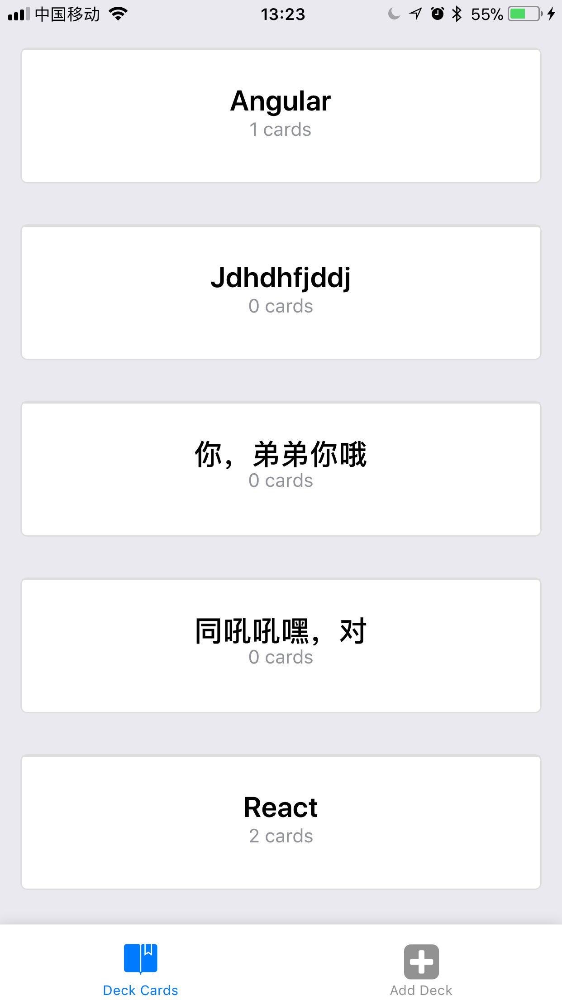

### 题卡应用

> made by craete-react-native-app

```bash

# 启动service
npm start

# Android service
npm run android

# ios service
npm run ios
```

> packages

- antd-mobile
- redux
- react-navigation

> project details
``` bash
src
├── actions
│   └── index.js
├── components
│   ├── AddCard.js                #新增卡片
│   ├── AddDeck.js                #新增题卡
│   ├── CardDetail.js             #题卡详情
│   ├── DeckCards.js              #题卡页
│   ├── Quizs.js                  #题库页
│   └── pure                      #非受控组件
│       ├── AppStatusBar.js       #状态栏
│       ├── DeckCard.js           #题卡
│       └── Quiz.js               #题
├── navgation
│   ├── MainTabNavigator.js       #Tab组合
│   └── RootNavigation.js         #Navigation组合
├── reducers
│   └── index.js
└── utils
    ├── api.js                    #store
    ├── colors.js                 #颜色
    └── constant.js               #常量
```

### screen short




